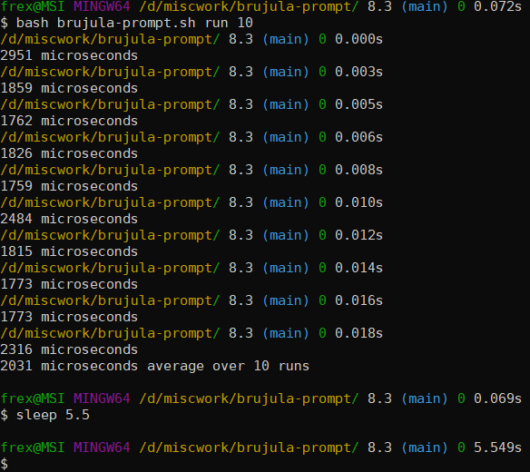

# brujula-prompt

Just source (via `source` or `.` builtin) the `brujula-prompt.sh` in your
`.bashrc` and then add ``__brujula_prompt`` to your `PS1`. Look at how
`__git_ps1` (comes with git-bash) is used and also replace the `\w` part
(that is current working directory). It does not call any external programs
(except for `git status --porcelain=v1` in a git repo if
`BRUJULA_USE_GIT_STATUS` is set to non-empty string)
Named by Spanish word for compass (brújula) since it shows you
where you are (path to repo, path in repo, branch/commit in repo).

It prints path, split into path to repo and path within the repo, adding a
single `/` and coloring them differently, and name of the branch or commit
sha1 (colored differently to additionally signify which one it is).

It also shows count of non-hidden and hidden files, in that order, in format:
`non-hidden.hidden` after the dir path, since I found that info useful daily
and it was easy to add, especially hidden files that I often forgot to look for.

It also counts the time of every commands, purely in shell.




Very rudimentary, might have mistakes in it, it has no configuration, doesn't
handle Windows style paths, bare repos, being inside .git dir itself, anything
fancy or out of the ordinary, pending changes, showing excluded/ignored
directories in different color, showing where submodules dirs start and end,
etc. but it might do some or all of these things in the future.

It's usable on Linux but was written for my use on Windows where `__git_ps1`
has perceptible delay due to it calling git once or twice (process creaton is
slow on Windows, on Linux calling even several binaries is not perceptible):
```
$ time __git_ps1 > /dev/null
real    0m0.150s
user    0m0.015s
sys     0m0.030s

$ time __brujula_prompt > /dev/null
real    0m0.004s
user    0m0.000s
sys     0m0.000s
```
