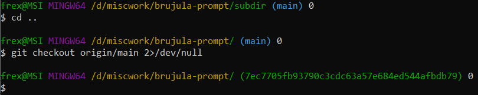

# brujula-prompt

A pure bash prompt on Windows and Linux. Tested on Ubuntu 20.04 LTS, Fedora and on Windows 10 (git bash).

# Information

Information shown is, in order:
1. username@hostname,
1. current working directory, including ~ for home, green for part inside git repo, and red if directory was deleted.
1. count of files and hidden files as matched by globs `*` and `.*` (so your bash glob settings affect this).
1. (if inside git repo) current branch name or commit hash (if in detached head mode).
1. (if inside git repo and `BRUJULA_USE_GIT_STATUS` is non-empty) symbols as in `git status --porcelain`, `D` for deletion, `?` for new file, `A` for new file added with git add, `M` for renamed file, etc.
1. uptime taken from `/proc/uptime`.
1. how many commands were executed so far in the current session.
1. return status of last command (0 in green, all other in red).
1. time taken by last command in seconds and milliseconds.
1. a newline and a `$` sign and a space, to provide prompt of same width as the terminal.

# Usage

To use Brujula, clone or download this repo (or just the `brujula-prompt.sh` file) and add such a line (with adjusted path) to your .bashrc or execute it manually: `source 'D:/brujula-prompt/brujula-prompt.sh' install`
To also enable the git status after the branch name add `BRUJULA_USE_GIT_STATUS=1` (no export needed, the prompt runs within same bash process, not as a subprocess).
Note: it also aliases the clear command, to update some internal bookkeeping and not print unnecessary newline after clear.
You can use `__brujula_prompt` and other necessary variables (needed for internal bookkeeping of timer, command count, etc.) directly, see `PS1` assignment in the code.
If you're interested in using Brujula this way (without using the install option to fit it into your own prompt instead) - open an issue.

These instructions are also printed if you run the script without sourcing it `bash brujula-prompt.sh`. To benchmark/test you can use `bash brujula-prompt.sh run 5` (the number at the end is amount of repetitions to do).

# Trivia

Named after Spanish word for compass (brújula) since it shows you where you are (path to repo, path in repo, branch/commit in repo, etc.).

Very rudimentary, might have mistakes in it, it has no configuration, doesn't
handle Windows style paths, bare repos, being inside .git dir itself, anything
fancy or out of the ordinary, showing excluded/ignored
directories in different color, showing where submodules dirs start and end,
etc. but it might do some or all of these things in the future.
It will also be slow on big directories due to counting number of files (I might add option to disable this).
I'm also not testing a single line prompt, so it might fail in that case (due to color codes not being marked with extra marks for bash as they should be, so bash might count the characters in them when calculating max line length after the prompt in case of a single line prompt).

My main reason for creating it was to use it on Windows where new process spawning is quite slow compared to Linux,
and to display more information than default prompt does, but now I also use it on Linux. Original `__git_ps1` from
git bash installation took up to 100-150 milliseconds per run and I could feel the latency, while Brujula takes around
10-30 (according to its own timer) and is not perceptible to me at all.
The only external process is `git status` and it's optional (controlled by `BRUJULA_USE_GIT_STATUS`
variable being non-empty) and only ran when inside a git repo.

I continuously improve it as I run into new features I want or new problems on both OSes I use. If you have any
feature request or spot any bug or bad interaction between some bash settings or such, let me know via issues.
